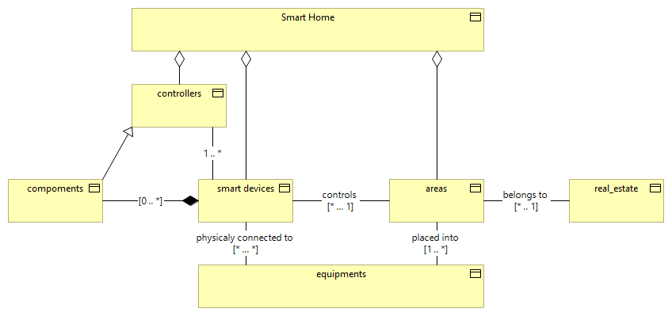

# Smart Home Conceptual Model
A smart home consists of smart devices that are physically connected to controlled equipment, such as heating, lamps, refrigerators, or water systems. These devices operate in an area, such as a room or a garden, that belongs to a real estate property, such as an apartment, building, or land. The smart device can be a commercial off-the-shelf unit or a DIY project composed of different components. The brain of the smart home is a smart home controller that can automate and optimize the performance of the devices.

# References
* [https://homematic-ip.com/](https://homematic-ip.com/)
* [https://vertabelo.com/blog/the-smart-home-data-model/](https://link-url-here.org](https://vertabelo.com/blog/the-smart-home-data-model/?fbclid=IwAR0J0Ghlk2T4E0lFH8a_H1HPy8TebGtqQh1AU6lqd9KYu6tKiDl5xJDcJ2I)https://vertabelo.com/blog/the-smart-home-data-model/?fbclid=IwAR0J0Ghlk2T4E0lFH8a_H1HPy8TebGtqQh1AU6lqd9KYu6tKiDl5xJDcJ2I)

